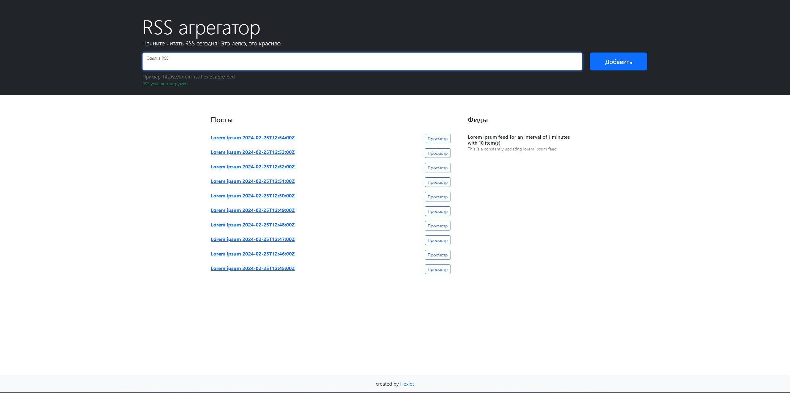

# Project "RSS aggregator"

[](https://codeclimate.com/github/xocoee/frontend-project-11/maintainability)

## Vercel link: [click](https://frontend-project-11-two-weld.vercel.app/)

## Project Description:

RSS aggregator can which collect RSS feeds and then watched for a new posts.

## Installation:
```sh
make install
```
```sh
make build
```
```sh
make start
```
