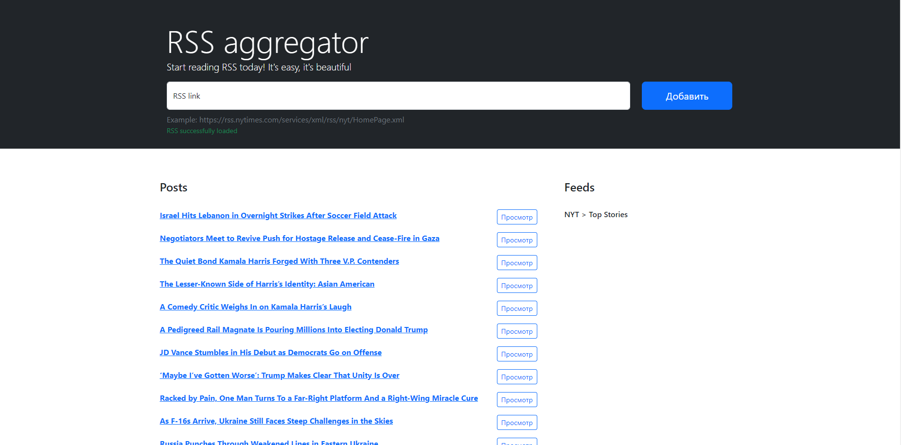

### Hexlet tests and linter status:

### Vercel link: [click](https://frontend-project-11-two-weld.vercel.app/)

### RSS aggregator

RSS aggregator can which collect RSS feeds and then watched for a new posts.

## Usage

Install dependencies and let your system run the package.

 